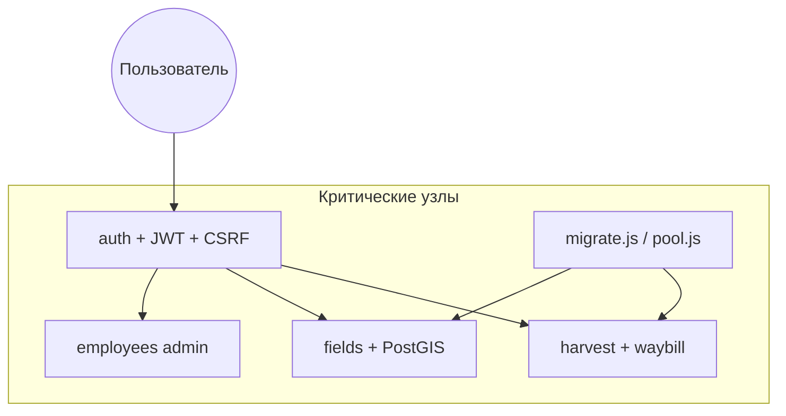

 4.5 Ревьюирование программного кода (рабочий материал для диплома)

## 4.5.1 Назначение и место в жизненном цикле

**Ревьюирование программного кода** в проекте веб-приложения «Партнер» — это систематическая и периодическая экспертиза исходных текстов (backend, frontend, SQL-миграции) с целью:

- выявить ошибки, не обнаруженные на этапах проектирования и первичной реализации;
- оценить качество архитектурных решений (модульность, связность, безопасность);
- локализовать **критические места** — участки кода, отказ которых ведёт к недоступности системы или потере/утечке данных.

Ревью проводилось **вручную** (чтение модулей, сценарии использования) с опорой на инструменты: ESLint (frontend), `npm audit`, контрольные сценарии входа и CRUD, проверка миграций БД. Автоматизированные модульные тесты на момент ревью **отсутствуют** — это зафиксировано как направление развития.

---

## 4.5.2 Методика систематического анализа

### Этапы одного цикла ревью

| Этап | Содержание | Артефакт |
|------|------------|----------|
| 1. Инвентаризация | Список модулей `backend/src/modules/*`, страниц `frontend/src/pages/*` | Матрица «модуль — ответственность» |
| 2. Статический просмотр | Маршруты, middleware, SQL, дублирование прав | Журнал замечаний |
| 3. Сверка с моделью данных | Миграции 001–010 vs `*.service.js` | Таблица несоответствий |
| 4. Безопасность | Auth, CSRF, CORS, параметризация SQL, роли | Чек-лист OWASP-lite |
| 5. Динамическая проверка | Контрольный пример (вход, поля, техкарта, путевой лист, отчёт) | Протокол испытания |
| 6. Зависимости | `npm audit` в корне, backend, frontend | Отчёт уязвимостей npm |

### Периодичность (регламент сопровождения)

| Событие | Периодичность |
|---------|----------------|
| Ревью после изменения модуля | Каждый коммит / итерация |
| Полный обход критических узлов | Перед релизом / защитой |
| Проверка `npm audit` | Ежемесячно |
| Сверка `module-access.js` (backend ↔ frontend) | При добавлении роли или раздела |
| Проверка миграций на чистой БД | При новом файле в `migrations/` |

---

## 4.5.3 Объект ревью: архитектура и критические места

### Архитектурная модель (оценка)

**Сильные решения:**

- модульный монолит Express (`routes` → `service` → `schemas`);
- доступ к БД через `pg` и именованные prepared statements;
- разграничение прав: `requireAuth`, `requireModuleAccess`, `requireRole`;
- JWT в `httpOnly` cookie + CSRF на мутациях;
- версионирование схемы SQL (`schema_migrations`).

**Архитектурные риски (выявлены ревью):**

| Риск | Описание |
|------|----------|
| Дублирование политики ролей | `module-access.js` на backend и frontend — риск рассинхронизации |
| Отсутствие слоя репозитория | SQL в сервисах усложняет повторное использование запросов |
| Неиспользуемые таблицы БД | `soil_samples`, `field_history` без API/UI |
| Нет операций DELETE | накопление ошибочных записей в реестрах |
| Двойной учёт площади поля | `area_ha` и `geometry` не пересчитываются сервером совместно |

### Критические места программы

| Узел | Критичность | Обоснование |
|------|-------------|-------------|
| `auth.routes`, `auth.service` | Высокая | Компрометация = полный доступ к данным |
| `db/pool.js`, `migrate.js` | Высокая | Без БД система неработоспособна (ошибка 42P01) |
| `fields.service` + PostGIS | Высокая | Ядро ГИС-функции предприятия |
| `harvest` + `waybill-email` | Средняя | Юридически значимые документы, SMTP |
| `finance.service` | Средняя | Целостность сумм |
| `employees.service` | Высокая | Учётные записи и пароли |

---

## 4.5.4 Результаты ревью: выявленные дефекты

Классификация по серьёзности (на момент первичного ревью; часть устранена рефакторингом, см. § 4.6).

### Критические (C)

| ID | Модуль | Описание | Статус |
|----|--------|----------|--------|
| C1 | `FieldsPage.jsx` | Пустой UI при работающем API полей | **Устранено** (восстановлен модуль) |
| C2 | `auth.routes.js` | Маршрут `POST /items` без auth и `createItem` | **Устранено** (удалён) |
| C3 | Деплой production | БД без миграций → «нет таблиц приложения» | **Регламент** (`migrate`, `start:railway`) |

### Существенные (S)

| ID | Модуль | Описание | Статус |
|----|--------|----------|--------|
| S1 | `waybill-email` | Рассылка всем водителям при неизвестном e-mail | **Устранено** |
| S2 | `harvest.routes` | Блокировка HTTP при ожидании SMTP | **Устранено** (фоновая очередь) |
| S3 | — | Отсутствие автотестов | Открыто |
| S4 | `planning.schemas` | Нет проверки дата начала ≤ дата окончания | Открыто |

### Незначительные (N)

| ID | Описание |
|----|----------|
| N1 | Дублирование подписей ролей в нескольких файлах |
| N2 | CSP в helmet ссылается на OSM, карта использует Esri |
| N3 | Глобальный rate-limit без отдельного лимита на login |

---

## 4.5.5 Сравнение характеристик модели до и после устранения замечаний

| Показатель | До ревью / рефакторинга | После |
|------------|-------------------------|-------|
| Мёртвые HTTP-маршруты | 1 | 0 |
| Неработающие разделы UI | «Поля и ГИС» | Работает |
| Время ответа при создании путевого листа (с SMTP) | Зависит от почты | Ответ сразу, почта в фоне |
| Риск массовой рассылки e-mail | Высокий | Низкий |
| Соответствие чек-листу безопасности auth | Частичное | Полное по маршрутам auth |
| Покрытие автотестами | 0 % | 0 % (не изменилось) |

---

## 4.5.6 Связь ревью с рефакторингом

По результатам ревью выполнена **трансформация модулей** (подробно — в разделе о рефакторинге, приложение с листингами `docs/refactoring/APPENDIX_CODE.md`):

1. **Auth** — удаление мёртвого кода, сужение поверхности API.
2. **Fields** — восстановление presentation-слоя и связки с `geo.js`.
3. **Harvest** — изменение модели доставки (асинхронность, политика адресатов).

Ревью и рефакторинг образуют замкнутый цикл: **анализ → замечания → исправление → повторная проверка**.

---

## 4.5.7 Чек-лист периодического ревью (10 пунктов)

1. Все маршруты в `*.routes.js` защищены `requireAuth` (кроме login/csrf/health).
2. Мутации используют `requireCsrf` и Zod-схемы.
3. `module-access` на backend и frontend совпадают.
4. `npm run migrate` на целевой БД успешен.
5. Контрольный вход и обход меню по ролям.
6. Нет пустых страниц в `frontend/src/pages/`.
7. Секреты не в репозитории (`JWT_SECRET`, пароли БД).
8. `npm audit` — критические уязвимости обработаны.
9. Логи без массовых `42P01`, `ECONNREFUSED`.
10. Документация деплоя актуальна (`DEPLOY-RAILWAY.md`, `README.md`).

---

## 4.5.8 Выводы по разделу 4.5

Систематическое и периодическое ревьюирование кода веб-приложения «Партнер» позволило выявить **критические дефекты реализации** (пустой модуль полей, лишний маршрут auth, риски при деплое БД) и **архитектурные ограничения** MVP (дублирование правил доступа, отсутствие тестов, неиспользуемые таблицы). По итогам ревью выполнен целевой рефакторинг трёх модулей; повторная проверка подтвердила улучшение эксплуатационных и безопасностных характеристик без смены технологического стека. Для промышленной эксплуатации рекомендуется закрепить регламент § 4.5.2–4.5.7 и внедрить минимальный набор автотестов на auth, миграции и расчёт площади контура.
