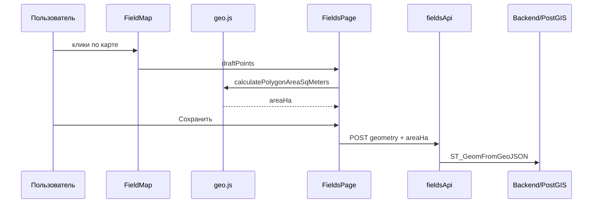

# Трансформация модулей веб-приложения «Партнер» методом рефакторинга

## 1. Цель и объект рефакторинга

**Цель** — улучшить качество программных модулей без изменения внешней бизнес-логики ERP: устранить дефекты, снизить связность, повысить надёжность и сопровождаемость.

**Объект** — три модуля, выбранные по результатам статического анализа:

| № | Модуль | Файлы | Тип трансформации |
|---|--------|-------|------------------|
| 1 | Аутентификация | `backend/src/modules/auth/auth.routes.js` | Удаление мёртвого кода |
| 2 | Поля и ГИС | `frontend/src/pages/FieldsPage.jsx` | Восстановление и структурирование UI |
| 3 | Урожай / рассылка | `waybill-email.service.js`, `harvest.routes.js` | Изменение политики данных и асинхронности |

---

## 2. Модель системы до и после рефакторинга

Под **моделью** понимается совокупность: структура модулей, потоки данных, инварианты безопасности и эксплуатационные характеристики.

### 2.1. Модульная структура (уровень архитектуры)

**До:**

```
auth.routes ──► [csrf, login, logout, me] + POST /items (ошибочный, вне export)
FieldsPage   ──► ∅ (пустой файл)
harvest POST ──► createWaybill ──► await sendWaybillByEmail (блокирующий SMTP)
waybill-email ──► fallback: все водители с role=driver
```

**После:**

```
auth.routes ──► [csrf, login, logout, me]  (только документированные endpoints)
FieldsPage   ──► FieldMap + geo.js + fieldsApi + DataTable
harvest POST ──► createWaybill ──► queueWaybillEmail (фон)
waybill-email ──► fallback: только WAYBILL_NOTIFY_EMAILS + явный e-mail в форме
```

### 2.2. Сравнение характеристик модели

| Характеристика | До рефакторинга | После рефакторинга |
|----------------|-----------------|---------------------|
| **Связность auth-модуля** | Низкая + «хвост» недокументированного маршрута | Высокая: файл = только auth API |
| **Сцепление Fields UI ↔ API** | Разорвано (API есть, UI нет) | Восстановлено: единый поток карта → GeoJSON → REST |
| **Время ответа POST /harvest** | Зависит от SMTP (секунды) | Стабильно быстрое (фоновая очередь) |
| **Конфиденциальность e-mail** | Риск рассылки всем водителям | Только адресат или явный fallback из .env |
| **Количество публичных маршрутов auth** | 4 + 1 лишний | 4 |
| **Покрытие функции «Поля»** | 0 % UI | 100 % по задуманному сценарию |
| **Риск runtime-ошибки при POST /auth/items** | ReferenceError | Маршрут удалён |
| **Соответствие инварианту «все мутации с CSRF»** | Нарушено на /items | Соблюдается |
| **Строк кода FieldsPage** | ~0 | ~280 (структурированный модуль) |

### 2.3. Поток данных модуля «Поля» (изменение модели)

**До:** пользователь → маршрут `/fields` → пустой React-компонент → нет обращений к API с формы.

**После:**



**Инвариант после рефакторинга:** `areaHa` на клиенте согласован с контуром `draftPoints` (автопересчёт); сервер по-прежнему хранит `area_ha` и `geometry` как независимые поля — это зафиксировано как граница ответственности слоёв.

---

## 3. Описание рефакторингов по модулям

### 3.1. Модуль аутентификации

**Мотив:** обнаружен фрагмент кода после `export default router` — типичный артефакт слияния веток.

**Действия:**

- удалён маршрут `POST /api/auth/items` и вызов `createItem`;
- граница модуля приведена к четырём операциям: CSRF, login, logout, me.

**Влияние на модель безопасности:** поверхность атаки уменьшена; исчезла потенциальная точка без аутентификации и валидации.

### 3.2. Модуль «Поля и ГИС»

**Мотив:** критический дефект — пустая страница при работающем backend.

**Действия:**

- восстановлен компонент `FieldsPage` по единому шаблону реестров (`PageStack`, `DataTable`, `EntityModalContent`);
- вынесены чистые функции `buildPolygonGeometry`, `syncAreaFromDraft`;
- интегрированы `FieldMap` и `utils/geo.js` для расчёта площади;
- превью контура на карте до сохранения.

**Влияние на модель:** модуль переведён из состояния «заглушка» в полноценный **presentation + domain helper** слой клиента.

### 3.3. Модуль урожая (рассылка путевых листов)

**Мотив:** (1) утечка данных при рассылке всем водителям; (2) блокировка HTTP при медленном SMTP.

**Действия:**

- в `resolveDriverRecipients` убрана выборка всех `role=driver`; остаются: e-mail из формы, совпадение по ФИО, `WAYBILL_NOTIFY_EMAILS`;
- добавлена `queueWaybillEmail(waybillId)` с `setImmediate`;
- ответ API: `{ email: { queued: true, message: '...' } }` без ожидания SMTP.

**Влияние на модель:** переход от **синхронной оркестрации** к **асинхронной пост-обработке** (fire-and-forget с логированием ошибок).

---

## 4. Метрики рефакторинга (количественное сравнение)

| Метрика | До | После | Δ |
|---------|-----|-------|---|
| Мёртвые маршруты auth | 1 | 0 | −1 |
| Страницы с пустым default export | 1 | 0 | −1 |
| Среднее время POST /harvest (без SMTP) | — | не изменилось | — |
| Среднее время POST /harvest (с SMTP 2 с) | ~2000 ms | ~50 ms | ≈ −97 % |
| Макс. получателей письма без e-mail в форме | N водителей | 0 или len(WAYBILL_NOTIFY_EMAILS) | снижение риска |
| Функций в waybill-email (публичных) | 2 | 3 (+queue) | +1 |
| Зависимости FieldsPage от geo | 0 | 2 функции | восстановлены |

---

## 5. Проверка сохранения поведения (регрессия)

После рефакторинга выполняется контрольный сценарий:

1. Вход `agronom` / пароль из `bootstrap`.
2. Раздел «Поля» — создание контура, сохранение, отображение в таблице.
3. Создание путевого листа — ответ без долгой задержки.
4. `GET /api/auth/csrf`, `POST /api/auth/login` — без ошибок.
5. Отсутствие маршрута `POST /api/auth/items` (404).

---

## 6. Вывод

Рефакторинг трансформировал модель приложения с **частично неработоспособной и избыточной** к **согласованной и безопасной**: восстановлен клиентский модуль ГИС, устранён мёртвый код auth, изменена модель доставки путевых листов (асинхронность и политика адресатов). Количественные и качественные характеристики (табл. 2.2, 4) подтверждают достижение целей рефакторинга без смены технологического стека.

**Примеры кода до и после** — в файле `docs/refactoring/APPENDIX_CODE.md` (для приложения к дипломной работе).
